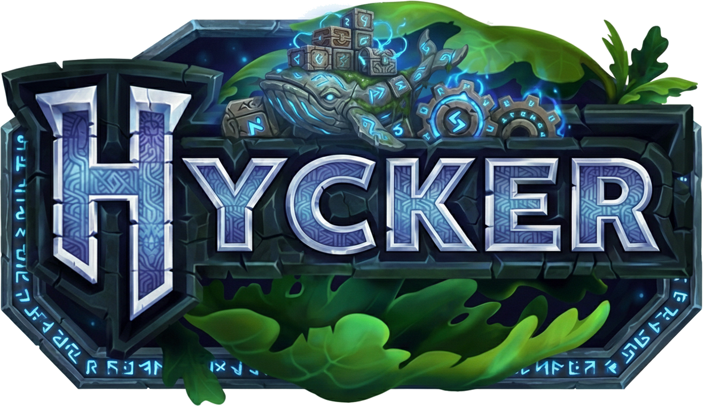

<div align="center">
  
</div>

# Hycker - Hytale Server Docker Container

A Docker container for running a Hytale game server with automated setup, backup support, and easy configuration through environment variables.

## ✨ Features

### 🔄 Automated Server Management

**OAuth2 Server Download**

- First-run automatic server file download via Hytale Downloader
- Secure OAuth2 authentication with credential caching
- Persistent `.hytale-downloader-credentials.json` for future updates

**Version Control & Auto-Update**

- Automatic version checking on every startup
- Visual warnings when new versions are available
- Optional auto-update via `HYTALE_AUTO_UPDATE=true`
- Version tracking in `.hytale-server-version` file

**Health Monitoring**

- Built-in health checks every 30 seconds
- Java process monitoring
- 60-second startup grace period
- 3 retry attempts before marking unhealthy

### 🧩 Plugin & Mod Management

**Multiple Mod Sources**

- **ZIP Downloads**: Direct URL file downloads
- **Google Drive**: Bulk folder downloads with `gdown` integration
- **CurseForge API**: Batch mod downloads by ID with intelligent versioning
- Automatic extraction and flattening of directory structures
- Orchestrated installation via `mods-downloader.sh`

**Plugin Configuration**

- Early plugin acceptance via `HYTALE_ACCEPT_EARLY_PLUGINS`
- Visual warnings for potentially risky configurations
- Additional Java arguments support via `HYTALE_ADDITIONAL_ARGS`

### 💾 Backup & Data Persistence

**Automated Backups**

- Configurable backup intervals (default: 30 minutes)
- Custom backup directory support
- Toggle backups on/off at runtime
- World data and configuration preservation

**Data Management**

- Persistent volume mounting (`./data:/hycker`)
- Separate directories for logs, mods, universe, and backups
- Configuration files: `config.json`, `bans.json`, `whitelist.json`, `permissions.json`

### 🔒 Security & Authentication

**Player Authentication**

- Authenticated mode (default): Requires valid Hytale accounts
- Offline mode: For private/LAN servers
- Configurable via `HYTALE_AUTH_MODE`

### 🎛️ Server Configuration

**Network Settings**

- Docker-compatible bind address (`0.0.0.0:5520`)
- UDP port mapping for game traffic
- Interactive console access via `docker attach`

**Performance Tuning**

- Customizable JVM memory allocation
- Default: `-Xms1G -Xmx4G`
- Additional Java arguments support
- Eclipse Temurin 25 JDK base image

**Asset Management**

- Automatic `Assets.zip` detection
- Parent directory fallback search
- Custom asset path configuration

### 🛠️ Developer Features

**Cross-Platform Compatibility**

- Automatic CRLF→LF line ending conversion
- Windows, macOS, and Linux support
- Consistent script execution across platforms

**Modular Architecture**

- Organized script structure in `/opt/hycker-scripts/`
- Sourced utility scripts for maintainability
- Extensible mod downloader system

**Interactive Console**

- Attach/detach without stopping server
- TTY and stdin support
- Real-time log viewing

---

## ⚠️ Requirements

Before running Hycker, ensure your system meets the following requirements:

### 🐋 Software Requirements

| Component      | Version | Purpose                       |
| -------------- | ------- | ----------------------------- |
| Docker         | 20.10+  | Container runtime             |
| Docker Compose | 2.0+    | Multi-container orchestration |

**Installation Guides:**

- [Docker Desktop](https://docs.docker.com/get-docker/) (Windows, macOS)
- [Docker Engine](https://docs.docker.com/engine/install/) (Linux)

### 💻 System Requirements

**Minimum Specifications:**

- **CPU**: 2 cores
- **RAM**: 2GB available (4GB recommended)
- **Storage**: 5GB free disk space
- **Network**: Port `5520/udp` available

**Recommended Specifications:**

- **CPU**: 4+ cores
- **RAM**: 8GB+ (adjust `JAVA_OPTS` accordingly)
- **Storage**: 20GB+ SSD
- **Network**: Stable internet connection

### 🔑 Additional Requirements

**First-Time Setup:**

- Valid Hytale account for OAuth2 authentication
- Access to Hytale Launcher credentials
- Browser for authentication flow

**Optional (for mod downloads):**

- Public Google Drive folder (if using `HYCKER_MODS_GDRIVE_URL`)

### 🌐 Port Configuration

Ensure the following port is available and not blocked by firewall:

```bash
# Check if port 5520 UDP is available (Linux/macOS)
sudo lsof -i :5520

# Windows PowerShell
Get-NetUDPEndpoint -LocalPort 5520
```

If port `5520` is already in use, modify the external port in `docker-compose.yml`:

```yaml
ports:
  - "25565:5520/udp" # Change 25565 to any available port
```

---

## 🚀 Quick Start

### Option A

**Using Pre-built Image from Docker Hub**

The Hycker image is available at: [https://hub.docker.com/r/jmbargueno/hycker](https://hub.docker.com/r/jmbargueno/hycker)

1. Copy the Docker-compose example

   ```
   version: "3.9"

   services:
     hycker:
       image: jmbargueno/hycker:latest
       container_name: hycker
       restart: unless-stopped
       tty: true
       stdin_open: true
       ports:
         - "5520:5520/udp" # Hytale server port (UDP)
       # Environment variables for server configuration
       environment:
         # Hytale server settings
         HYTALE_ASSETS_PATH: "Assets.zip"
         HYTALE_AUTH_MODE: "authenticated"
         HYTALE_BIND_ADDRESS: "0.0.0.0:5520"
         # Backup configuration
         HYTALE_BACKUP_ENABLED: "true"
         HYTALE_BACKUP_FREQUENCY: "30"
         HYTALE_BACKUP_DIR: "/hycker/backups"
         # Server features
         HYTALE_DISABLE_SENTRY: "false"
         # Java memory configuration
         JAVA_OPTS: "-Xms1G -Xmx4G"
         # Auto update feature
         HYTALE_AUTO_UPDATE: "true"
         # Mods configuration (example CurseForge mod IDs)
         HYCKER_MODS_CURSEFORGE_IDS: "1423494,1409811"
       # Volume mounts for persistent data
       volumes:
         # All server data mounted to local ./data directory
         - ./data:/hycker
       network_mode: bridge

   ```

2. Run the container:
   ```bash
   docker-compose up -d
   ```
3. On first run, follow the OAuth2 authentication prompts to download server files
4. The server will start automatically once files are downloaded

### Option B

1. Clone this repository
2. Run the container:
   ```bash
   docker-compose up -d
   ```
3. On first run, follow the OAuth2 authentication prompts to download server files
4. The server will start automatically once files are downloaded

## 🔐 First-Time Setup

On first run, the container will:

1. Download the Hytale downloader tool
2. Prompt for OAuth2 authentication
3. Display a URL and authorization code
4. Open the URL in your browser and authenticate
5. Download and extract server files automatically

**Important**: Keep the `.hytale-downloader-credentials.json` file in your data directory for future updates.

### Interactive Server Console

Attach to the running container to access the server console:

```bash
docker attach hycker
```

Press `Ctrl+P` then `Ctrl+Q` to detach without stopping the server.

---

## ⚙️ Environment Variables

| Variable                      | Description                                                                                                                                                                            | Default           | Example                                              |
| ----------------------------- | -------------------------------------------------------------------------------------------------------------------------------------------------------------------------------------- | ----------------- | ---------------------------------------------------- |
| `HYTALE_ASSETS_PATH`          | Path to the Assets.zip file                                                                                                                                                            | `Assets.zip`      | `Assets.zip`                                         |
| `HYTALE_AUTH_MODE`            | Authentication mode for players                                                                                                                                                        | `authenticated`   | `authenticated` or `offline`                         |
| `HYTALE_BIND_ADDRESS`         | Server bind address and port                                                                                                                                                           | `0.0.0.0:5520`    | `0.0.0.0:5520`                                       |
| `HYTALE_BACKUP_ENABLED`       | Enable automatic backups                                                                                                                                                               | `true`            | `true` or `false`                                    |
| `HYTALE_BACKUP_FREQUENCY`     | Backup interval in minutes                                                                                                                                                             | `30`              | `30`, `60`, `120`                                    |
| `HYTALE_BACKUP_DIR`           | Directory for backup storage                                                                                                                                                           | `/hycker/backups` | `/hycker/backups`                                    |
| `HYTALE_DISABLE_SENTRY`       | Disable Sentry crash reporting                                                                                                                                                         | `false`           | `true` or `false`                                    |
| `JAVA_OPTS`                   | JVM memory and performance options                                                                                                                                                     | `-Xms1G -Xmx4G`   | `-Xms2G -Xmx8G`                                      |
| `HYTALE_AUTO_UPDATE`          | If `true`, automatically updates to the latest Hytale server version when available. If `false`, only prints a warning if a new version is detected.                                   | `false`           | `true` or `false`                                    |
| `HYCKER_MODS_ZIP_URL`         | URL of a mod ZIP to download and extract into `data/mods` before starting the server                                                                                                   | _(empty)_         | `https://example.com/mods.zip`                       |
| `HYCKER_MODS_GDRIVE_URL`      | Google Drive folder URL to download all mods from before starting the server                                                                                                           | _(empty)_         | `https://drive.google.com/drive/folders/<FOLDER_ID>` |
| `HYCKER_MODS_CURSEFORGE_IDS`  | Comma-separated list of CurseForge mod IDs to download before starting the server                                                                                                      | _(empty)_         | `12345,67890`                                        |
| `HYTALE_CURSEFORGE_API_KEY`   | API key for CurseForge API (optional for custom builds)                                                                                                                                | _(empty)_         | `your-api-key`                                       |
| `HYTALE_ACCEPT_EARLY_PLUGINS` | If `true`, enables the `--accept-early-plugins` flag when starting the server. Prints a yellow warning: "[WARNING] --accept-early-plugins is enabled. Early plugins will be accepted!" | `false`           | `true`                                               |
| `HYTALE_ADDITIONAL_ARGS`      | Additional arguments to append to the Java command when starting the server. If set, these will be shown in yellow at startup. Useful for custom JVM or server flags.                  | _(empty)_         | `-Dfile.encoding=UTF-8`                              |

## ➕ Additional Java Arguments

If the environment variable `HYTALE_ADDITIONAL_ARGS` is set, its contents will be appended to the Java command when starting the server. The arguments will be displayed in yellow at startup for visibility. This is useful for passing custom JVM options or server flags.

Example:

```
HYTALE_ADDITIONAL_ARGS="-Dfile.encoding=UTF-8 -Duser.timezone=UTC"
```

This will add those options to the Java process that runs the Hytale server.

---

## 📁 Project Structure

```
hycker/
├── Dockerfile                                   # Multi-stage Docker image (eclipse-temurin:25-jdk-jammy)
├── docker-compose.yml                           # Service definition with port mapping and volumes
├── docker-compose.dev.yml                       # Development environment configuration
├── entrypoint.sh                                # Main orchestration script (startup & initialization)
├── test-curl.sh                                 # Testing utility for server endpoints
├── README.md                                    # Project documentation
├── assets/
│   └── hycker_logo.png                          # Project logo
├── scripts/
│   ├── SCRIPTS.md                               # Detailed scripts documentation
│   ├── download-server.sh                       # Server file download automation (OAuth2)
│   ├── backup-config.sh                         # Backup configuration management
│   ├── display-startup-info.sh                  # Startup information display
│   ├── mods-downloader.sh                       # Mod download orchestrator
│   └── mods_downloaders/
│       ├── download-mods-from-zip-url.sh        # Download mods from ZIP URL
│       ├── download-mods-gdrive.sh              # Download mods from Google Drive
│       └── download-mods-curseforge.sh          # Download mods from CurseForge API
└── data/                                        # Persistent data volume (mounted to /hycker)
```

## 📂 Data Directory Structure

```
data/
├── Server/                          # Hytale server files
│   └── HytaleServer.jar             # Main server executable
├── Assets.zip                       # Game assets
├── config.json                      # Server configuration
├── bans.json                        # Banned players list
├── whitelist.json                   # Whitelisted players
├── permissions.json                 # Player permissions
├── logs/                            # Server logs
├── mods/                            # Server mods
├── universe/                        # World data
│   ├── players/                     # Player data
│   └── worlds/                      # World saves
└── backups/                         # Automated backups (if enabled)
```

---

## 🛠️ Troubleshooting

### Server won't start

- Check logs: `docker-compose logs`
- Verify `Server/HytaleServer.jar` exists in `./data/Server/`
- Ensure `Assets.zip` is present in `./data/`

### Authentication issues

- Delete `.hytale-downloader-credentials.json` from `./data/`
- Restart container to re-authenticate

### Performance issues

- Increase `JAVA_OPTS` memory allocation
- Reduce `MaxPlayers` in `data/config.json`
- Check server resources with `docker stats hycker`

### Port binding errors

- Ensure port 25573 UDP is not in use
- Check firewall settings
- Verify `HYTALE_BIND_ADDRESS` is set to `0.0.0.0:5520`

---

## 📝 License

This project is a Docker containerization of the Hytale game server. Hytale and related assets are property of Hypixel Studios.

## 🔗 Links

- **GitHub**: https://github.com/JMBargueno/hycker
- **Docker Hub**: https://hub.docker.com/r/jmbargueno/hycker
- **Hytale**: https://hytale.com/

## 🤝 Contributing

Contributions are welcome! Please feel free to submit issues or pull requests.

1. Fork the repository
2. Create a feature branch
3. Commit your changes
4. Push to the branch
5. Open a Pull Request
